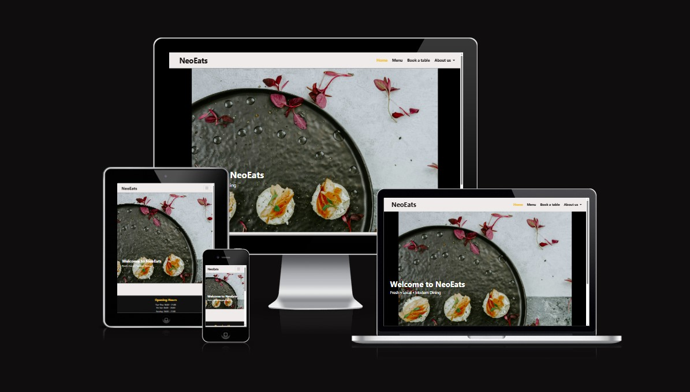
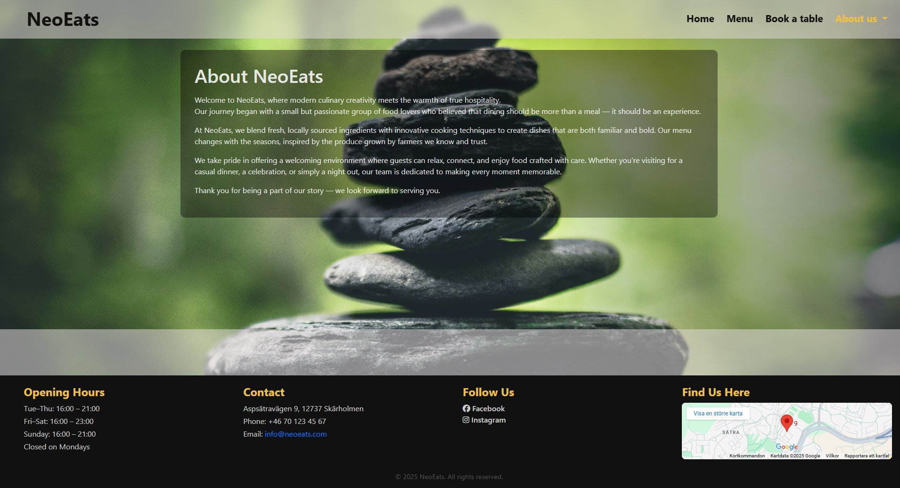
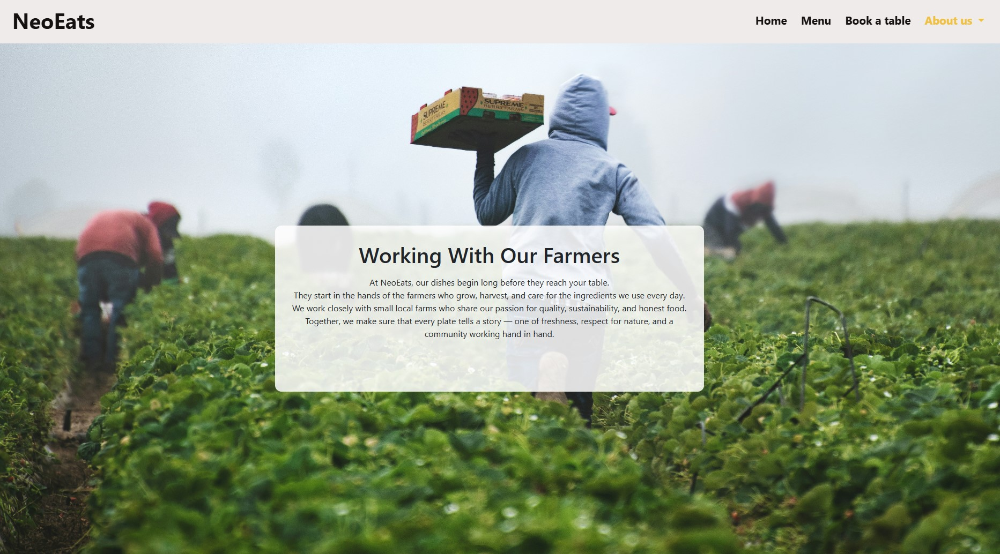
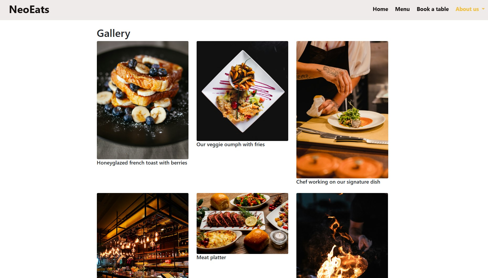
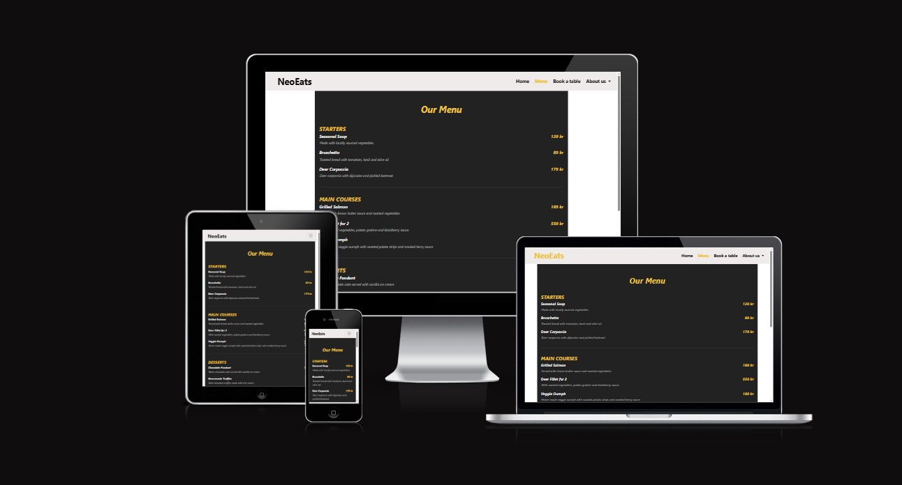
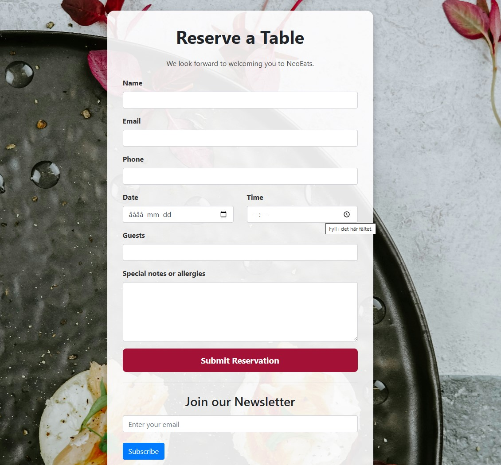

# NeoEats

## NeoEats Restaurant Website

NeoEats is a modern, fully responsive restaurant website built with Django, featuring a custom CMS, an image gallery powered by Cloudinary, and deployment through Heroku.

It allows the restaurant owner to manage menu items, gallery images, “About” text, and booking information through Django Admin.

The site is designed to work seamlessly on desktop, tablet, and mobile devices.

 

# How the Site Looks on Different Devices

# How It Works
## NeoEats is a content-managed restaurant website consisting of:

### About Page 
 

### Gallery 

### Menu Page 

### Booking Page 

Editable title + text.

Dynamically generated from Django models—add dishes in the admin panel.

Editable title + text.

Uses Cloudinary to store and serve gallery images with fast CDN delivery.

A simple reservation form styled to match the site’s aesthetic.

Home Page

Hero image, introduction text, and navigation links.

All content is editable through Django Admin, without ever touching the codebase.

 

# Features
## Core Features

Fully responsive layout

Custom Django CMS (About, Menu Items, Gallery, Collaboration Page)

Gallery with Cloudinary image hosting

Booking page with form

Accessible navigation and clear design

Deployed on Heroku

Static files served via Whitenoise

Media files through Cloudinary

Admin Features

Upload and manage images

Add/edit/delete menu items

Edit About page content

Edit collaboration/farmers page

Simple and clean admin UI

Newsletter signup

 

# Future Features

Booking email confirmations

Multi-category menu filtering

Customer reviews page

Add alt-text fields to gallery images

User login system for customers

 

# Testing

All templates tested across Chrome, Edge, Safari, and mobile devices

Manual testing of:

Image uploads

Form inputs

Navigation

Page responsiveness

Django server tested locally with DEBUG on and off

Verified static & media file behavior in production

Cloudinary URL reliability confirmed

 

## Solved Bugs

Heroku staticfiles 500 error fixed by:

Adding STATIC_ROOT

Removing broken .venv/ folder from repo

Allowing Heroku to run collectstatic normally

Cloudinary images not loading:

Fixed malformed CLOUDINARY_URL config

Images missing due to local static folder conflict — resolved by cleaning static directory

VSCode virtual environment accidentally committed — fixed with .gitignore and repo cleanup

Deleted and recreated deployments after debugging environment conflicts

 

# Remaining Bugs

None currently known.

 

# Validator Testing

Python code validated using flake8 and PEP8 tools

HTML validated through W3C validator

No major issues encountered

 

# Heroku Deployment Steps

Create a new Heroku app

Add buildpack: heroku/python

Add required Config Vars:

DATABASE_URL

CLOUDINARY_URL

SECRET_KEY

Ensure the .venv directory is not in Git

Push to Heroku using:

git push heroku main

Live site deploys at:
https://neoeats-62e4965fe040.herokuapp.com/

 

# Credits

Cloudinary for image hosting

Heroku for deployment

Django documentation for model/template references

Bootstrap for styling layout inspiration

My mentor for guidance

ChatGPT for debugging and explanations along the way

ChatGPT for docstring documentation

ami.responsive for device preview screenshot