# NeoEats

## NeoEats Restaurant Website

NeoEats is a modern, fully responsive restaurant website built with Django. It features a custom CMS, an image gallery powered by Cloudinary, and an online booking system. The project is deployed using Heroku.

The platform allows restaurant staff to manage menu items, gallery images, “About” content, and booking information through Django Admin.

The site is optimised for desktop, tablet, and mobile devices.

---

## Live Site

🔗 https://neoeats-62e4965fe040.herokuapp.com/

---

## Responsive Design

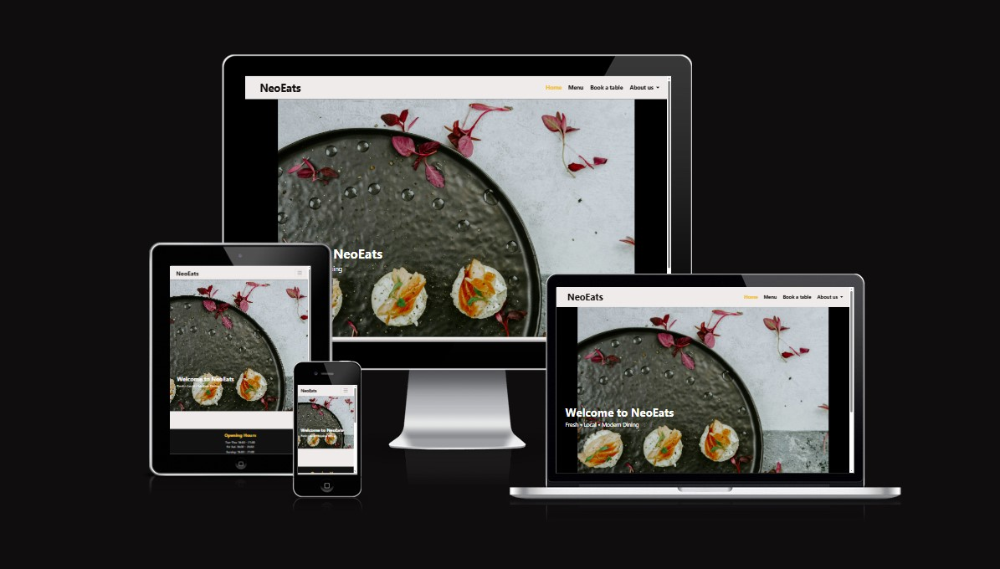

---

## UX Design

### Design Goals

The design of NeoEats focuses on simplicity, clarity, and accessibility.  
The primary goal was to create a clean restaurant website where users can easily explore the menu, view images, and book a table.

Key design priorities:

* Clear navigation across all devices
* Fast page loading using CDN-hosted media
* Responsive layout for mobile and tablet users
* Minimal visual clutter to highlight food imagery

The layout uses a traditional restaurant structure:

Home → Menu → Booking → About → Gallery

This ensures that new users can quickly understand the website and access the booking system.

---

### Colour Scheme

The design uses a neutral colour palette inspired by modern restaurant branding.

* Dark tones for navigation and headers
* Light backgrounds for readability
* Accent colours used for buttons and interactive elements

This provides strong contrast and improves accessibility.

---

### Typography

The typography is designed for readability across all screen sizes.

* Headings emphasise key sections
* Body text remains clean and readable
* Consistent spacing improves scanning behaviour for users

---

## Wireframes

Wireframes were created during the planning phase to define layout structure and user flow.

### Desktop Wireframes

* Home Page
* Menu Page
* Booking Page

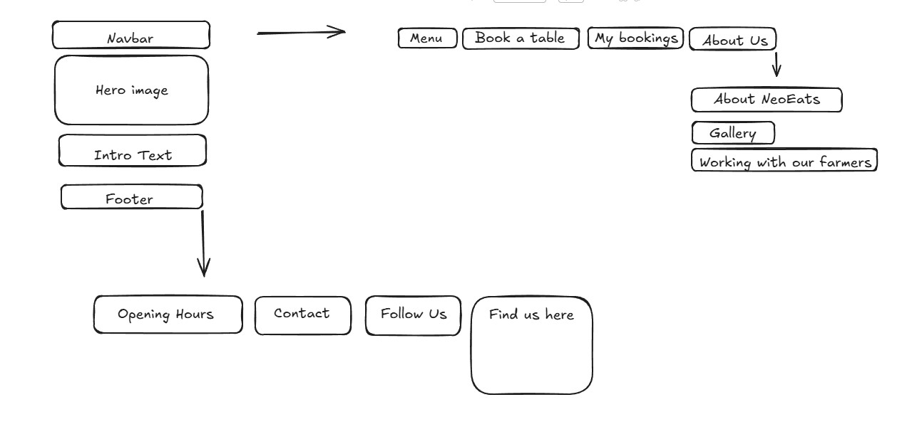

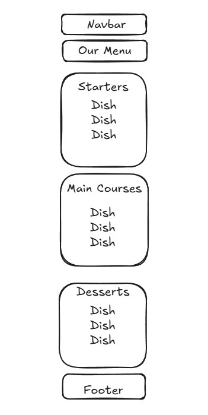

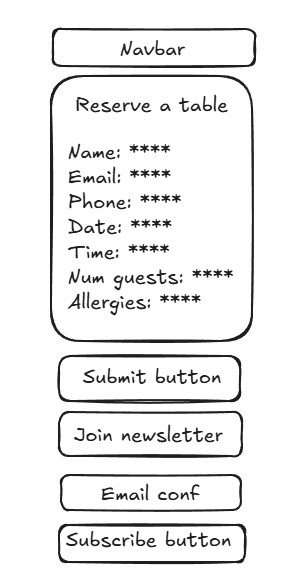

### Mobile Wireframes

Mobile layouts prioritise vertical scrolling and simplified navigation.

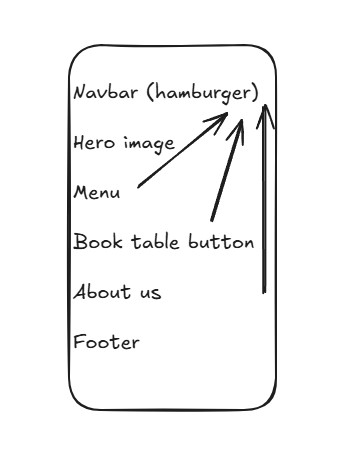

---

## Database Schema

The application uses a relational PostgreSQL database.

Key models include:

### Booking

| Field | Type |
|------|------|
| user | ForeignKey |
| name | CharField |
| email | EmailField |
| date | DateField |
| time | TimeField |
| guests | IntegerField |
| status | CharField |

Relationships:

* Each booking is associated with a registered user.
* Bookings can be created, edited, cancelled, or deleted by the owner.

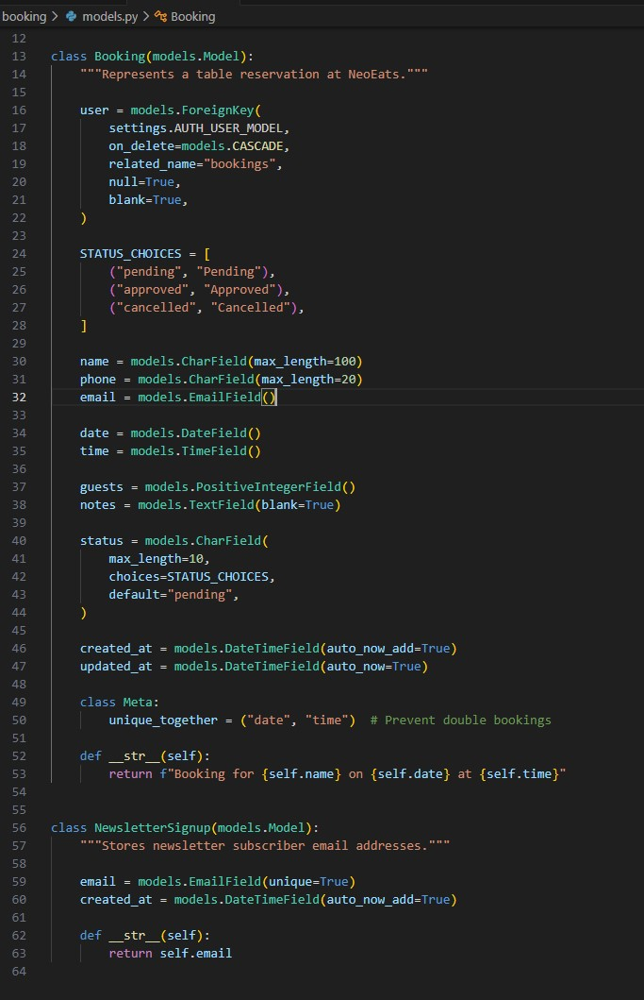

---

## Pages & Functionality

### Home Page
* Hero banner
* Introduction text
* Navigation links

### About Page
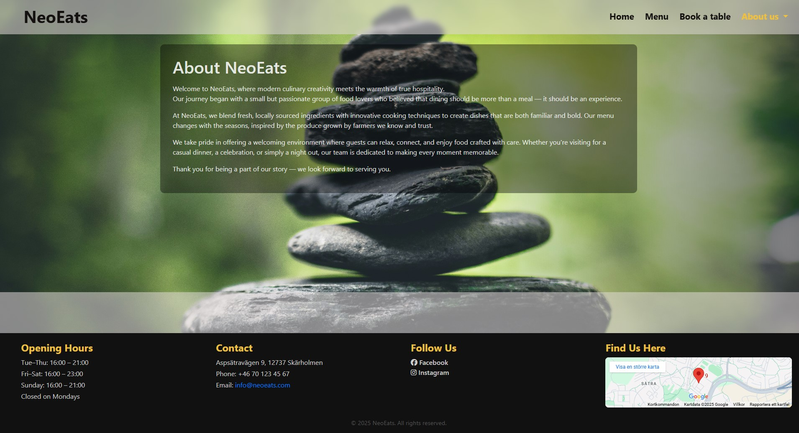  
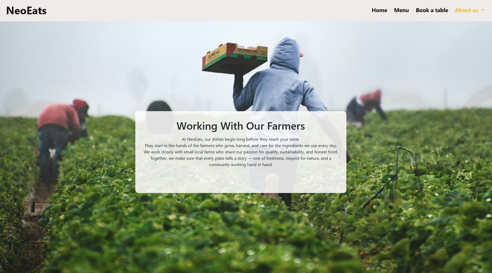

* Editable title and content
* Managed through Django Admin

### Gallery
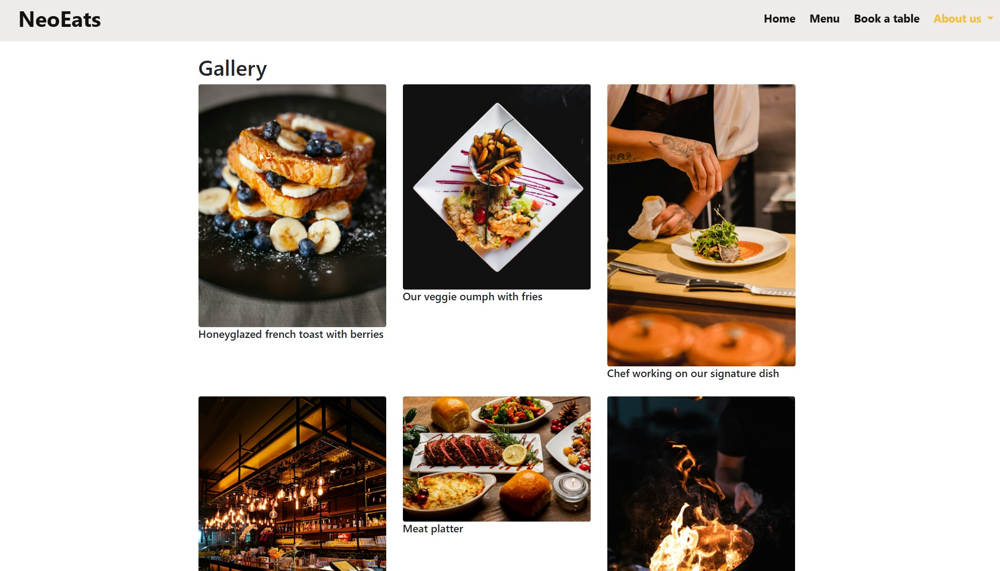

* Cloudinary-powered image hosting
* CDN delivery for performance

### Menu
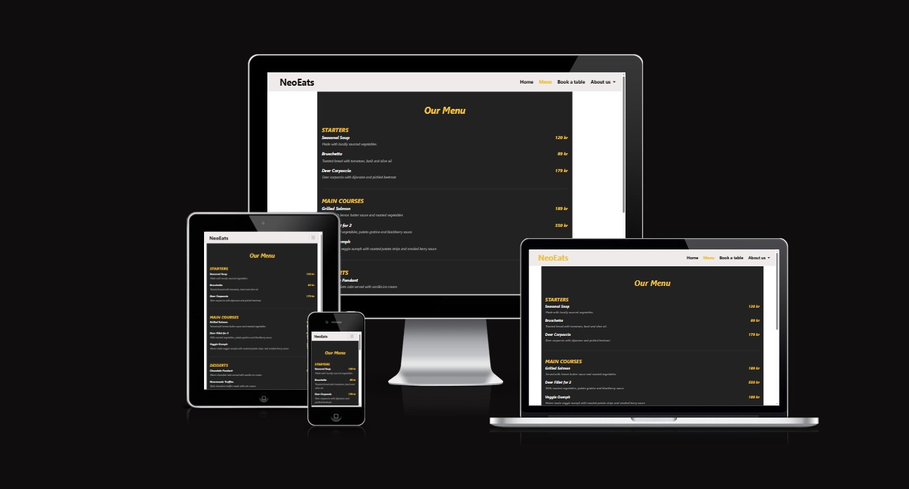

* Dynamically generated from database
* Categorised dishes
* Admin-managed

### Booking
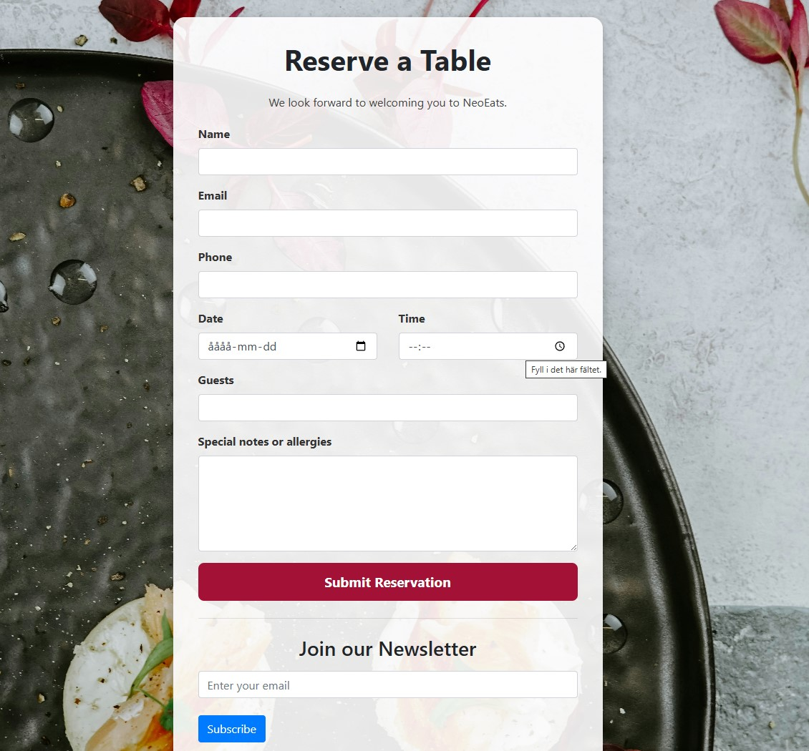

* Secure booking form
* User authentication
* Newsletter signup

---

## Features

### Core Features
* Fully responsive layout
* Custom Django CMS
* Cloudinary media storage
* Booking system
* Newsletter signup
* Secure authentication
* Accessible navigation

### User Features
* View the restaurant menu.
* Browse the image gallery.
* Read information about the restaurant on the About page.
* Create an account.
* Make a table booking through the booking form.
* Recieve confirmation that the booking request was submitted.
* Manage booking by either editing, cancelling or deleting it.
* Sign up for the newsletter.

### Admin Features

The Django Admin interface provides a simple content management system for restaurant staff.

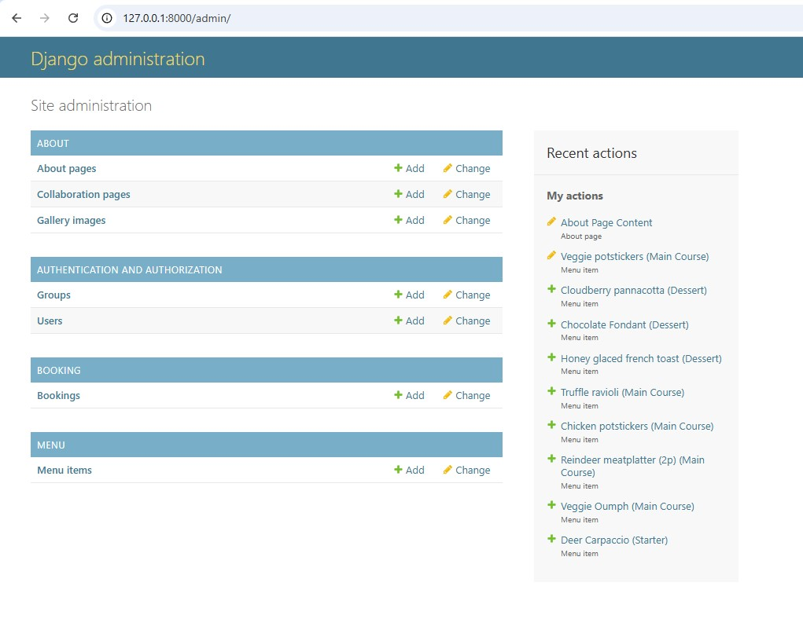

Admin users can manage:

* Image management using Cloudinary.
* Menu management
* Content editing
* Booking administration through the Django Admin panel.
* User accounts

### Technical Features
* Django framework
* PostgreSQL database
* Whitenoise for static files
* Cloudinary for media
* Heroku deployment

---

## Future Enhancements
* Automated booking confirmation emails
* Advanced menu filtering
* Customer reviews
* Image alt-text support
* Analytics dashboard

---

## Testing

### Automated Testing

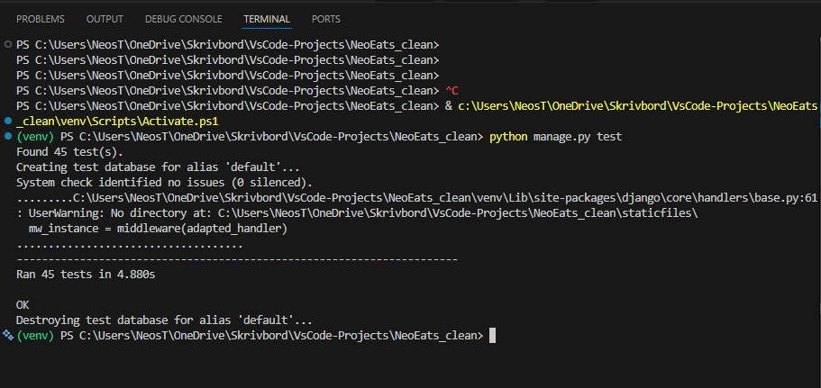

Each Django app follows a consistent testing structure:

```md
```text
app_name/tests/
├── __init__.py
├── test_models.py
├── test_views.py
├── test_urls.py
├── test_templates.py
├── test_admin.py
├── test_apps.py
└── test_forms.py   (Booking app only)

---

### Test Coverage

#### Core App
* View rendering
* URL resolution
* Template content
* App configuration

#### Menu App
* Model validation
* Category grouping
* View context
* URL mapping
* Admin registration

#### About App
* Models
* Views
* URLs
* Templates
* Admin setup

#### Booking App
* Models
* Form validation
* Booking logic
* Newsletter logic
* View behaviour
* URL resolution

---

### Running Tests

**Test suite result: 45 tests across about, booking, core, and menu apps. All passing.**

### Manual Testing
* Cross-browser testing (Chrome, Edge, Safari)
* Mobile responsiveness
* Form validation
* Navigation flow
* Media uploads
* Production static/media handling

---

### Resolved Issues
* Heroku staticfiles 500 error
* Cloudinary URL misconfiguration
* Static directory conflicts
* Accidental virtual environment commits
* Deployment environment inconsistencies

During development, multiple bugs and validation issues were resolved using official documentation,
browser developer tools, and online developer communities. This includes fixing HTML/CSS validation errors,
form rendering issues, and responsive layout problems.

All known critical issues have been resolved.

---

## Known Issues

No known unresolved bugs at this time.

---

## Validation/testing and formatting

The project was validated using several standard development and validation tools to ensure code quality and compliance with best practices.

### Python

Python code follows **PEP8 standards** and was checked using **Flake8** to identify style issues and potential errors.

Python formatting was also applied using **Black** to ensure consistent and clean code structure.

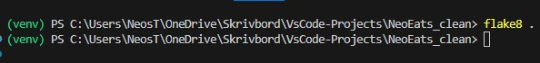

### HTML

All HTML files were validated using the **W3C Markup Validation Service**.

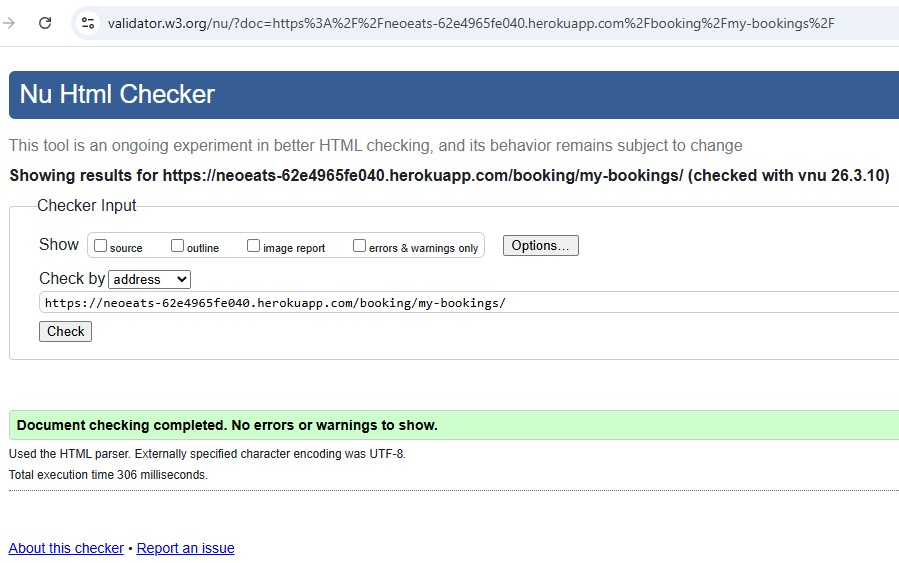

### CSS

CSS styling was validated using the **W3C CSS Validation Service**.

The validator reported warnings related to external third-party libraries such as **Bootstrap** and **Font Awesome**, which are loaded via CDN. These warnings are expected and do not affect the functionality or styling of the custom project code.

No major errors were detected in the project’s own CSS.

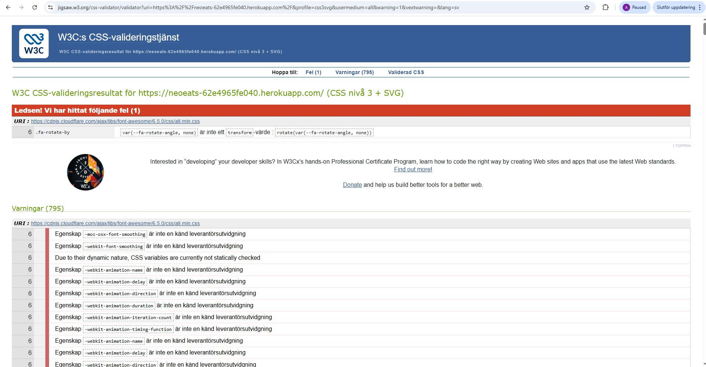


### Summary

Validation tools used in this project:

- Python: **PEP8 compliance**
- HTML: **W3C validation**
- CSS: **W3C validation**
- Python formatting: **Black**
- Linting: **Flake8**

No major validation errors were detected.

---

### Deployment

### Local Deployment

To run the project locally:

1. Clone the repository 
https://github.com/LadyNeowen/NeoEats

2. Navigate into the project

3. Create a virtual environment

4. Activate the environment
Windows: venv\Scripts\activate

5. Install dependencies
pip install -r requirements.txt

6. Set environment variables
Required variables:

* SECRET_KEY
* DATABASE_URL
* CLOUDINARY_URL

7. Run migrations
python manage.py migrate

8. Run the development server
python manage.py runserver

---

### Heroku Deployment

1. Create a Heroku app
2. Connect GitHub repository
3. Add environment variables:
SECRET_KEY
DATABASE_URL
CLOUDINARY_URL
4. Deploy the main branch
5. Heroku runs migrations automatically using the Procfile release phase.

---

## Technologies Used

### Backend
* Django
* Python

### Database
* PostgreSQL

### Frontend
* HTML5
* CSS3
* Bootstrap

### Deployment
* Heroku
* Cloudinary
* Whitenoise

---

### Security

Sensitive settings such as SECRET_KEY, DATABASE_URL and CLOUDINARY_URL
are stored in environment variables and not committed to the repository.

---

## Project Goals

The main goal of this project was to develop a fully functional restaurant website with dynamic content management,
secure user authentication, and a complete booking system, while following modern web standards and best practices.

---

## Agile Development

The project was developed using an Agile approach with GitHub Issues used to track user stories and tasks.

### Example User Stories

**User Story: Book a Table**

As a customer  
I want to book a table online  
So that I can reserve a place at the restaurant.

Acceptance Criteria:

* User must be logged in
* Booking form must validate inputs
* Booking is saved in the database

---

**User Story: Edit Booking**

As a user  
I want to edit my booking  
So that I can change the time or number of guests.

Acceptance Criteria:

* Existing booking data is prefilled
* Changes update the database
* Confirmation message displayed

---

**User Story: Delete Booking**

As a user  
I want to delete a booking  
So that I can cancel my reservation permanently.

Acceptance Criteria:

* Delete option visible in "My Bookings"
* Confirmation page displayed
* Booking removed from database

---

## References

### Authentication & Permissions
* https://docs.djangoproject.com/en/5.2/topics/auth/
* https://developer.mozilla.org/en-US/docs/Learn_web_development/Extensions/Server-side/Django/Authentication

### Forms & Views
* https://docs.djangoproject.com/en/5.2/topics/forms/
* https://docs.djangoproject.com/en/5.2/topics/http/shortcuts/#get-object-or-404

### Delete functionality implemented following Django documentation and tutorials
* https://docs.djangoproject.com/en/6.0/ref/class-based-views/generic-editing/
* https://www.geeksforgeeks.org/python/delete-view-function-based-views-django/

### Models
* https://docs.djangoproject.com/en/5.2/topics/db/models/
* https://www.digitalocean.com/community/tutorials/how-to-create-django-models

### Testing
* https://docs.djangoproject.com/en/5.2/topics/testing/overview/
* https://realpython.com/pytest-python-testing/


---

## Credits and Acknowledgements
* Cloudinary (image hosting)
* Heroku (deployment)
* Django Documentation
* Bootstrap
* ami.responsive
* Mentor support
* LMA Content
* https://unsplash.com/ (Images)
* https://restaurant--booking-465b6b7fd829.herokuapp.com/  
* https://github.com/DiarmuidHenry/Restaurant-Booking  
* https://www.youtube.com/watch?v=DIFaOkxy6TE

### ChatGPT
* Docstring documentation
* Debugging and assistance
* Swedish translations and explinations
* Structuring and folder build
* Test strategy guidance
* Cross checking Assessment criteria and required fixes

---

